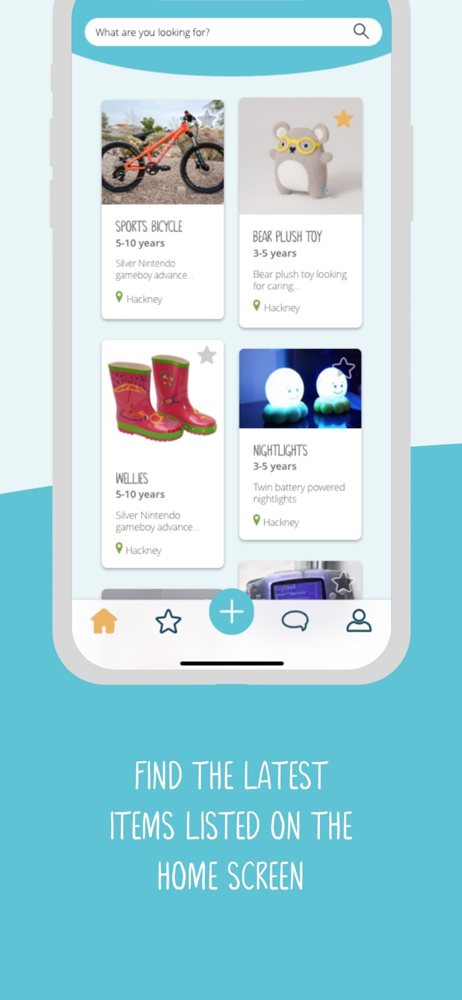

# Young-Planet

Young-planet is a platform used for Items exchanging that will turn the stuff you don't need into the things that others enjoy.
 
Users can enlist their items and be able to see other users enlisted items. They can select any item and are able to communicate with other users via chat and can mark that item as a favorite. Users can manage their requested item and their own item.
 
It is devolped using <b>react.js, react-native, redux, redux-saga and react-navigation.</b>

### ScreenShot:-

Figure : 1 splash screen

 

Figure : 2 Homepage

 
